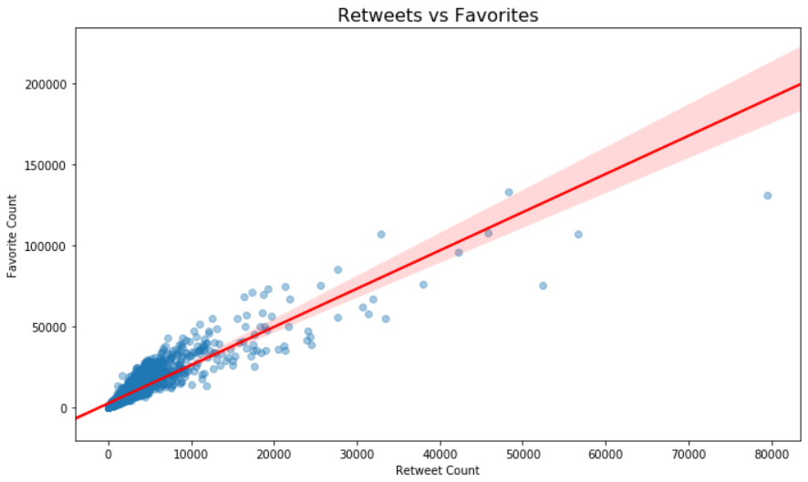

# WeRateDogs Data Wrangling & Analysis Project

## Overview

This repository contains my **Level 3 Data Wrangling and Analysis Project** for the **Level Three: Data Science and AI** course. 

The goal is to practice real-world data wrangling, cleaning, and exploratory data analysis (EDA) using the popular **@dog_rates** Twitter account, better known as **WeRateDogs**.

---

## Project Summary

**Objectives:**  
- Gather raw data from multiple sources (CSV, TSV, JSON API)  
- Assess and clean for data quality and tidiness  
- Merge into a single, well-structured master dataset  
- Analyze the data to uncover what makes dog tweets go viral!

**Data Sources:**  
- `twitter_archive_enhanced.csv` — 2,000+ WeRateDogs tweets from 2015–2017  
- `image_predictions.tsv` — Dog breed predictions generated by a pre-trained image classifier  
- `tweet_json.txt` — Tweet metadata (likes, retweets) gathered via the Twitter API

---

## Key Findings

After fully wrangling and analyzing the data, I found that:

-  **Dog Stage Drives Engagement:** Tweets that mention a dog's life stage (*pupper*, *doggo*, *floofer*) receive about **43% more likes and retweets** than those that don’t.
-  **Strong Likes–Retweets Correlation:** There is a clear positive correlation (**r = 0.92**) — highly liked tweets also get more retweets.
-  **Most Popular Breeds:** Golden Retrievers, Labradors, Pugs, and Corgis consistently appear in top-engagement tweets.
-  **Images Matter:** High-quality photos are a key driver of engagement.

---

##  Repository Structure

| File | Description |
|------|-------------|
| `wrangle_act.ipynb` | Notebook for gathering, assessing, cleaning, and merging the data |
| `act_report.ipynb` | Final analysis notebook that explores insights and visualizations |
| `wrangle_report.ipynb` | Short summary notebook describing the data wrangling process |
| `twitter_archive_master.csv` | Final cleaned dataset used for analysis |
| `image_predictions.tsv` | Machine-predicted dog breed labels |
| `tweet_json.txt` | JSON data with tweet engagement metrics |
| `requirements.txt` | Python dependencies for this project |
| `/images/` | Local folder with header and scatterplot images used in the README |

---

## How to Run This Project

**Clone the Repository**

\`\`\`bash
git clone https://github.com/asamir12/DECI_Lvl3_Wrangling_And_Analyze_Data_Project.git
cd DECI_Lvl3_Wrangling_And_Analyze_Data_Project
\`\`\`

**Install the Required Packages**

\`\`\`bash
pip install -r requirements.txt
\`\`\`

**Launch the Notebooks**

\`\`\`bash
jupyter notebook
\`\`\`

Open \`wrangle_act.ipynb\` to see the data gathering and cleaning pipeline.  
Open \`act_report.ipynb\` to explore the final analysis, insights, and visual results.

---

## Skills Practiced

- Gathering data from multiple file formats and an API
- Assessing and cleaning messy real-world data
- Merging and tidying multiple dataframes
- Exploratory Data Analysis (EDA) with meaningful plots
- Communicating insights in a clear, concise written report

---

## Acknowledgments

- [WeRateDogs](https://twitter.com/dog_rates) for their amazing and fun dataset.
- [Udacity Level Three: Data Science and AI course](https://www.udacity.com/enrollment/nd003-deci-data-l3-term1) for providing the project framework and guidelines.
- The Python open-source community for powerful libraries like Pandas, NumPy, Matplotlib, Seaborn, and Tweepy.

---

## License

This project is licensed under the [MIT License](LICENSE). The project is for educational and portfolio use only.  
No commercial use of the WeRateDogs brand or imagery is intended.

---

## Connect with Me

**Abdalrahman Samir**  
[GitHub](https://github.com/asamir12) | [LinkedIn](https://www.linkedin.com/in/abdalrahman-karam/)
